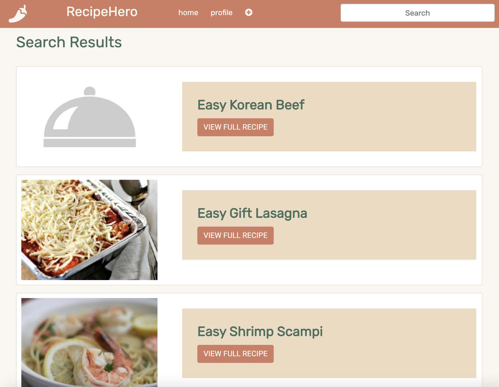

## Recipe Hero Prototype

**The API: Spoonacular API**

The [Spoonacular API](https://spoonacular.com/food-api) is a collection of recipes from across the internet which 
contains data on ingredients, nutrient values, allergens, and even price per serving for over 5,000 recipes across 
many cuisines. The reason why we chose Spoonacular in particular is because it provides additional functionality that
other food recipe apis don't provide. For example, in addition to the various dietary information per recipe, it also
includes detailed step-by-step instructions for each recipe in the api (which is uncommon for most food apis). Although
we have to pay for a api key, we believe that Spoonacular provides the best api framework for RecipeHero and gives the
option for our website to integrate some of the api's various functionality if we so choose.

**The Search Criteria**

Our app uses Spoonacular's [complex search](https://spoonacular.com/food-api/docs#Search-Recipes-Complex) to allows 
users to search for recipes using keywords. Thanks to the complex search, users can enter a plethora of 
different search parameters (e.g. name of food, cuisine, dietary restrictions, dinner foods, fat content, etc)
and expect to find plenty of results. Users can search from any page on the site using the search form located in the 
navigation bar. In our example below, we showcased an example of a specific ingredient (beef) and a food type (dinner)
as an example of the flexibility of our search.For a full list of parameters, please check out the Spoonacular 
documentation linked above.

**The Search Results**

Once the user enters their search criteria in the search form and presses enter, they are redirected to a search results 
page populated by result cards for each recipe. Each result card has a button to take users to see the full details of 
the recipe. The image and name of the recipes come right from the api itself. In the future, we will find a way to
differentiate recipes from the Spoonacular api and user-submitted recipes via methods like card color.

**The Details Page**

By clicking on the "view full recipe" button on a search card, the user can view the complete details page for any 
recipe. Once the results are shown, we use Spoonacular's [recipe information search](https://spoonacular.com/food-api/docs#Get-Recipe-Information)
to retrieve more detailed recipe information, including summary, preparation steps, dietary tags, etc.
For this prototype, the details page renders the source link for the recipe, its title, a summary (which is a 
bit jumbled coming from the API &mdash; this will be fixed in a future iteration of the app), servings, cook time, 
cuisine, ingredients, and instructions. Eventually, this page will also display additional information like dietary and 
allergen tags (static example tags are currently visible), along with ratings and user reviews beneath the recipe itself. 

**Examples**

Query: "beef"

Query: "easy dinner"

