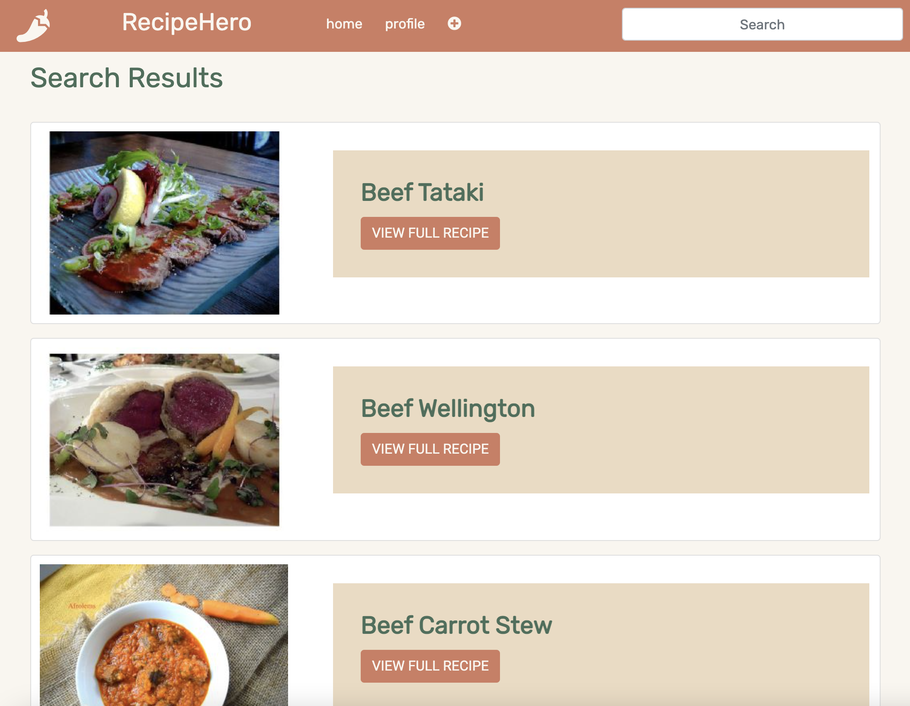

## Recipe Hero Prototype

**The API: Spoonacular API**

The [Spoonacular API](https://spoonacular.com/food-api) is a collection of recipes from across the internet which 
contains data on ingredients, nutrient values, allergens, and even price per serving for over 5,000 recipes across 
many cuisines.

**The Search Criteria**

Our app uses Spoonacular's [complex search](https://spoonacular.com/food-api/docs#Search-Recipes-Complex) to allows 
users to search for recipes using keywords. Users can type in a search term like "beef", "easy dinner", or "gluten free" 
and expect to find plenty of results. Users can search from any page on the site using the search form located in the 
navigation bar.

**The Search Results**

Once the user enters their search criteria in the search form and presses enter, they are redirected to a search results 
page populated by result cards for each recipe. Each result card has a button to take users to see the full details of 
the recipe.

**The Details Page**

By clicking on the "view full recipe" button on a search card, the user can view the complete details page for any 
recipe. For this prototype, the details page renders the source link for the recipe, its title, a summary (which is a 
bit jumbled coming from the API &mdash; this will be fixed in a future iteration of the app), servings, cook time, 
cuisine, ingredients, and instructions. Eventually, this page will also display dietary and allergen tags (static 
example tags are currently visible), along with user reviews beneath the recipe itself.

**Examples**

Query: "beef"

Query: "easy dinner"

